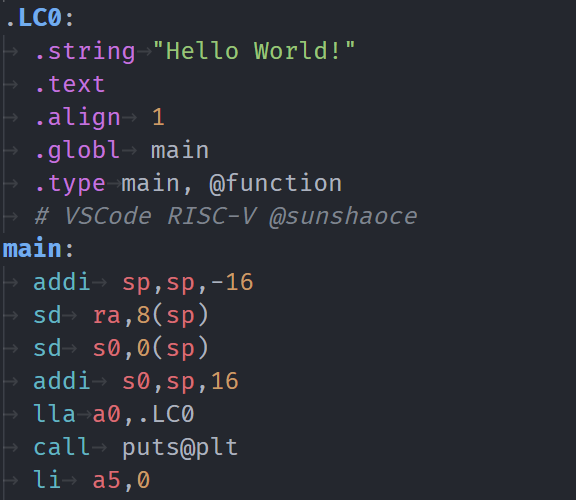

# RISC-V

[This project](https://github.com/sunshaoce/RISC-V) is copied and adapted from [MIPS Support](https://github.com/kdarkhan/vscode-mips-support) and [RISC-V Support](https://github.com/zhuanhao-wu/vscode-riscv-support).

## Features
This VSCode extension provides basic RISC-V colorization and snippets support. All RISC-V Extensions will be supported in the future, welcome to [Issue](https://github.com/sunshaoce/RISC-V/issues) and [PR](https://github.com/sunshaoce/RISC-V/pulls).

### Colors

#### Supported
- `RV32I` Extension
- `RV64I` Extension
- `RV128I` Extension
- `RV32E` Extension
- `RV64E` Extension
- `RV128E` Extension
- `A` Extension
- `C` Extension
- `D` Extension
- `F` Extension
- `M` Extension
- `Q` Extension
- `V` Extension
- `Zba` Extension
- `Zbb` Extension
- `Zbc` Extension
- `Zbs` Extension
- `Zca` Extension
- `Zcb` Extension
- `Zcd` Extension
- `Zcf` Extension
- `Zcmp` Extension
- `Zcmt` Extension
- `Zdinx` Extension
- `Zfh` Extension
- `Zfhmin` Extension
- `Zfinx` Extension
- `Zhinx` Extension
- `Zhinxmin` Extension
- `Zicsr` Extension
- `Zifencei` Extension
- `Zmmul` Extension

- GCC Assembler directives
- LLVM Assembler directives
- Preprocessors like `#include` and `#define`
- Comments: `#`, `//` and `/* */`

### Snippets

The extension is based on Textmate's [MIPS bundle](https://github.com/textmate/mips.tmbundle).
