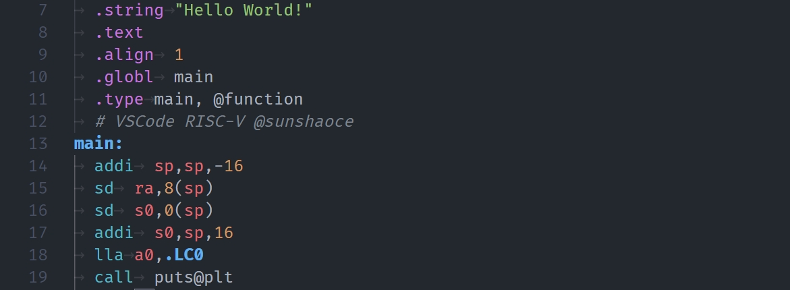

# RISC-V

[This project](https://github.com/sunshaoce/RISC-V) is copied and adapted from [MIPS Support](https://github.com/kdarkhan/vscode-mips-support) and [RISC-V Support](https://github.com/zhuanhao-wu/vscode-riscv-support).

## Features
This VSCode extension provides basic RISC-V colorization and snippets support. All RISC-V Extensions will be supported in the future, welcome to [Issue](https://github.com/sunshaoce/RISC-V/issues) and [PR](https://github.com/sunshaoce/RISC-V/pulls).

## Colors

## All Supported Extensions
1. `A` Atomic Extension, version 2.1
1. `B` Bitmanip Extension, version 1.0
1. `C` Compressed Extension, version 2.0
1. `D` Double-Precision Extension, version 2.2
1. `E` (`RV32E` / `RV64E` / `RV128E`) Embedded Extension, version 2.0
1. `F` Single-Precision Extension, version 2.2
1. `G` (`I`, `M`, `A`, `F`, `D`, `Zicsr`, `Zifencei`) General Extensions
1. `H` Hypervisor Extension, version 1.0
1. `I` (`RV32I` / `RV64I` / `RV128I`) Integer Extension, version 2.1
1. `M` Multiplication Extension, version 2.0
1. `P` Extension, version 0.14
1. `Q` Quard-Precision Extension
1. `Sdext` Extension, version 1.0
1. `Sdtrig` Extension, version 1.0
1. `Sha` Extension, version 1.0
1. `Shcounterenw` Extension, version 1.0
1. `Shgatpa` Extension, version 1.0
1. `Shlcofideleg` Extension, version 1.0
1. `Shtvala` Extension, version 1.0
1. `Shvsatpa` Extension, version 1.0
1. `Shvstvala` Extension, version 1.0
1. `Shvstvecd` Extension, version 1.0
1. `Smaia` Extension, version 1.0
1. `Smcdeleg` Extension, version 1.0
1. `Smcntrpmf` Extension, version 1.0
1. `Smcsrind` Extension, version 1.0
1. `Smctr` Extension, version 1.0
1. `Smdbltrp` Extension, version 1.0
1. `Smepmp` Extension, version 1.0
1. `Smmpm` Extension, version 1.0
1. `Smnpm` Extension, version 1.0
1. `Smrnmi` Extension, version 1.0
1. `Smstateen` Extension, version 1.0
1. `Ssaia` Extension, version 1.0
1. `Ssccfg` Extension, version 1.0
1. `Ssccptr` Extension, version 1.0
1. `Sscofpmf` Extension, version 1.0
1. `Sscounterenw` Extension, version 1.0
1. `Sscsrind` Extension, version 1.0
1. `Ssctr` Extension, version 1.0
1. `Ssdbltrp` Extension, version 1.0
1. `Ssnpm` Extension, version 1.0
1. `Sspm` Extension, version 1.0
1. `Ssqosid` Extension, version 1.0
1. `Ssstateen` Extension, version 1.0
1. `Ssstrict` Extension, version 1.0
1. `Sstc` Extension, version 1.0
1. `Sstvala` Extension, version 1.0
1. `Sstvecd` Extension, version 1.0
1. `Ssu64xl` Extension, version 1.0
1. `Supm` Extension, version 1.0
1. `Svade` Extension, version 1.0
1. `Svadu` Extension, version 1.0
1. `Svbare` Extension, version 1.0
1. `Svinval` Extension, version 1.0
1. `Svnapot` Extension, version 1.0
1. `Svpbmt` Extension, version 1.0
1. `Svukte` Extension, version 0.3
1. `Svvptc` Extension, version 1.0
1. `V` Vector Extension, version 1.0
1. `Za128rs` Extension, version 1.0
1. `Za64rs` Extension, version 1.0
1. `Zaamo` Extension, version 1.0
1. `Zabha` Extension, version 1.0
1. `Zacas` Extension, version 1.0
1. `Zalasr` Extension, version 0.1
1. `Zalrsc` Extension, version 1.0
1. `Zama16b` Extension, version 1.0
1. `Zawrs` Extension, version 1.0
1. `Zba` Extension, version 1.0
1. `Zbb` Extension, version 1.0
1. `Zbc` Extension, version 1.0
1. `Zbkb` Extension, version 1.0
1. `Zbkc` Extension, version 1.0
1. `Zbkx` Extension, version 1.0
1. `Zbs` Extension, version 1.0
1. `Zca` Extension, version 1.0
1. `Zcb` Extension, version 1.0
1. `Zcd` Extension, version 1.0
1. `Zce` Extension, version 1.0
1. `Zcf` Extension, version 1.0
1. `Zclsd` Extension, version 1.0
1. `Zcmop` Extension, version 1.0
1. `Zcmp` Extension, version 1.0
1. `Zcmt` Extension, version 1.0
1. `Zdinx` Extension, version 1.0
1. `Zfa` Extension, version 1.0
1. `Zfbfmin` Extension, version 1.0
1. `Zfh` Extension, version 1.0
1. `Zfhmin` Extension, version 1.0
1. `Zfinx` Extension, version 1.0
1. `Zhinx` Extension, version 1.0
1. `Zhinxmin` Extension, version 1.0
1. `Zic64b` Extension, version 1.0
1. `Zicbom` Extension, version 1.0
1. `Zicbop` Extension, version 1.0
1. `Zicboz` Extension, version 1.0
1. `Ziccamoa` Extension, version 1.0
1. `Ziccamoc` Extension, version 1.0
1. `Ziccif` Extension, version 1.0
1. `Zicclsm` Extension, version 1.0
1. `Ziccrse` Extension, version 1.0
1. `Zicfilp` Extension, version 1.0
1. `Zicfiss` Extension, version 1.0
1. `Zicntr` Extension, version 2.0
1. `Zicond` Extension, version 1.0
1. `Zicsr` Extension, version 2.0
1. `Zifencei` Extension, version 2.0
1. `Zihintntl` Extension, version 1.0
1. `Zihintpause` Extension, version 2.0
1. `Zihpm` Extension, version 2.0
1. `Zilsd` Extension, version 1.0
1. `Zimop` Extension, version 1.0
1. `Zk` Extension, version 1.0
1. `Zkn` Extension, version 1.0
1. `Zknd` Extension, version 1.0
1. `Zkne` Extension, version 1.0
1. `Zknh` Extension, version 1.0
1. `Zkr` Extension, version 1.0
1. `Zks` Extension, version 1.0
1. `Zksed` Extension, version 1.0
1. `Zksh` Extension, version 1.0
1. `Zkt` Extension, version 1.0
1. `Zmmul` Extension, version 1.0
1. `Ztso` Extension, version 1.0
1. `Zvbb` Extension, version 1.0
1. `Zvbc` Extension, version 1.0
1. `Zvbc32e` Extension, version 0.7
1. `Zve32f` Extension, version 1.0
1. `Zve32x` Extension, version 1.0
1. `Zve64d` Extension, version 1.0
1. `Zve64f` Extension, version 1.0
1. `Zve64x` Extension, version 1.0
1. `Zvfbfmin` Extension, version 1.0
1. `Zvfbfwma` Extension, version 1.0
1. `Zvfh` Extension, version 1.0
1. `Zvfhmin` Extension, version 1.0
1. `Zvkb` Extension, version 1.0
1. `Zvkg` Extension, version 1.0
1. `Zvkgs` Extension, version 0.7
1. `Zvkn` Extension, version 1.0
1. `Zvknc` Extension, version 1.0
1. `Zvkned` Extension, version 1.0
1. `Zvkng` Extension, version 1.0
1. `Zvknha` Extension, version 1.0
1. `Zvknhb` Extension, version 1.0
1. `Zvks` Extension, version 1.0
1. `Zvksc` Extension, version 1.0
1. `Zvksed` Extension, version 1.0
1. `Zvksg` Extension, version 1.0
1. `Zvksh` Extension, version 1.0
1. `Zvkt` Extension, version 1.0
1. `Zvl1024b` Extension, version 1.0
1. `Zvl128b` Extension, version 1.0
1. `Zvl16384b` Extension, version 1.0
1. `Zvl2048b` Extension, version 1.0
1. `Zvl256b` Extension, version 1.0
1. `Zvl32768b` Extension, version 1.0
1. `Zvl32b` Extension, version 1.0
1. `Zvl4096b` Extension, version 1.0
1. `Zvl512b` Extension, version 1.0
1. `Zvl64b` Extension, version 1.0
1. `Zvl65536b` Extension, version 1.0
1. `Zvl8192b` Extension, version 1.0
1. `Zvqdotq` Extension, version 0.0

## Waiting Supported Vendor Extensions
1. `Xandesperf` Extension, version 5.0
1. `Xandesvdot` Extension, version 5.0
1. `Xandesvpackfph` Extension, version 5.0
1. `Xcvalu` Extension, version 1.0
1. `Xcvbi` Extension, version 1.0
1. `Xcvbitmanip` Extension, version 1.0
1. `Xcvelw` Extension, version 1.0
1. `Xcvmac` Extension, version 1.0
1. `Xcvmem` Extension, version 1.0
1. `Xcvsimd` Extension, version 1.0
1. `Xepi` Extension, version 1.0
1. `Xmipscmov` Extension, version 1.0
1. `Xmipslsp` Extension, version 1.0
1. `Xqccmp` Extension, version 0.1
1. `Xqcia` Extension, version 0.7
1. `Xqciac` Extension, version 0.3
1. `Xqcibi` Extension, version 0.2
1. `Xqcibm` Extension, version 0.8
1. `Xqcicli` Extension, version 0.3
1. `Xqcicm` Extension, version 0.2
1. `Xqcics` Extension, version 0.2
1. `Xqcicsr` Extension, version 0.3
1. `Xqciint` Extension, version 0.7
1. `Xqciio` Extension, version 0.1
1. `Xqcilb` Extension, version 0.2
1. `Xqcili` Extension, version 0.2
1. `Xqcilia` Extension, version 0.2
1. `Xqcilo` Extension, version 0.3
1. `Xqcilsm` Extension, version 0.5
1. `Xqcisim` Extension, version 0.2
1. `Xqcisls` Extension, version 0.2
1. `Xqcisync` Extension, version 0.3
1. `Xrivosvisni` Extension, version 0.1
1. `Xrivosvizip` Extension, version 0.1
1. `Xsfcease` Extension, version 1.0
1. `Xsfmclic` Extension, version 0.1
1. `Xsfmm128t` Extension, version 0.6
1. `Xsfmm16t` Extension, version 0.6
1. `Xsfmm32a16f` Extension, version 0.6
1. `Xsfmm32a32f` Extension, version 0.6
1. `Xsfmm32a8f` Extension, version 0.6
1. `Xsfmm32a8i` Extension, version 0.6
1. `Xsfmm32t` Extension, version 0.6
1. `Xsfmm64a64f` Extension, version 0.6
1. `Xsfmm64t` Extension, version 0.6
1. `Xsfmmbase` Extension, version 0.6
1. `Xsfsclic` Extension, version 0.1
1. `Xsfvcp` Extension, version 1.0
1. `Xsfvfnrclipxfqf` Extension, version 1.0
1. `Xsfvfwmaccqqq` Extension, version 1.0
1. `Xsfvqmaccdod` Extension, version 1.0
1. `Xsfvqmaccqoq` Extension, version 1.0
1. `Xsifivecdiscarddlone` Extension, version 1.0
1. `Xsifivecflushdlone` Extension, version 1.0
1. `Xtheadba` Extension, version 1.0
1. `Xtheadbb` Extension, version 1.0
1. `Xtheadbs` Extension, version 1.0
1. `Xtheadcmo` Extension, version 1.0
1. `Xtheadcondmov` Extension, version 1.0
1. `Xtheadfmemidx` Extension, version 1.0
1. `Xtheadmac` Extension, version 1.0
1. `Xtheadmemidx` Extension, version 1.0
1. `Xtheadmempair` Extension, version 1.0
1. `Xtheadsync` Extension, version 1.0
1. `Xtheadvdot` Extension, version 1.0
1. `Xventanacondops` Extension, version 1.0
1. `Xwchc` Extension, version 2.2

## All Supported Assembly Grammer
- Lowercase/Uppercase
- `.insn` directives
- GCC Assembler directives
- LLVM Assembler directives
- Preprocessors like `#include` and `#define`
- Comments: `#`, `//` and `/* */`

## Snippets

The extension is based on Textmate's [MIPS bundle](https://github.com/textmate/mips.tmbundle).
